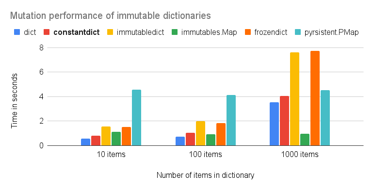

Comparison of dictionary implementations
========================================

Features
--------

.. list-table::
   :header-rows: 1

   * - Package
     - License
     - Deterministic iteration order
     - Frozen/Immutable
     - Mutation algorithm [#f1]_
   * - :class:`dict`
     - ✅ PSF
     - ✅
     - ❌
     - 🟡 Single copy
   * - :class:`~constantdict.constantdict`
     - ✅ MIT
     - ✅
     - ✅
     - 🟡 Single copy
   * - :class:`~immutabledict.immutabledict`
     - ✅ MIT
     - ✅
     - ✅
     - ❌ Double copy
   * - `immutables.Map <https://github.com/MagicStack/immutables>`__
     - ✅ Apache 2.0
     - ❌
     - ✅
     - ✅ Partial copy
   * - `frozendict <https://github.com/Marco-Sulla/python-frozendict>`__
     - ❌ LGPL-3.0
     - ✅
     - ✅
     - ❌ Double copy
   * - :class:`pyrsistent.PMap`
     - ✅ MIT
     - ❌
     - ✅
     - ✅ Partial copy

.. [#f1] Mutation algorithms are the following:

    Single copy (dict, constantdict):

    .. code-block:: python

          # dict:
          new_dict = dict(old_dict)  # copy
          new_dict[key] = value  # mutation

          # constantdict:
          new_dict = old_dict.mutate()  # copy
          new_dict[key] = value  # mutation
          new_dict = new_dict.finish()  # no copy

    Double copy (immutabledict, frozendict):

    .. code-block:: python

          new_dict = dict(old_dict)  # copy
          new_dict[key] = value  # mutation
          new_dict = immutabledict(new_dict)  # copy

    Partial copy (immutables.Map, pyrsistent.PMap): Similar to single copy, but only the changed nodes need to be updated/added.

Performance
-----------

Non-mutating operations
~~~~~~~~~~~~~~~~~~~~~~~

Code
****

These results were generated with the following code, found in
`examples/speed.py <https://github.com/matthiasdiener/constantdict/blob/main/examples/speed.py>`__ in the
source distribution:

.. raw:: html

    

.. literalinclude:: ../examples/speed.py
   :language: python

.. raw:: html

    

Results
*******

Results (total time of 10,000 executions) for Python 3.11 on a Mac M1:

.. image:: dict_performance_small.png
    :width: 90%
    :alt: dict non-mutation performance small

.. image:: dict_performance_large.png
    :width: 90%
    :alt: dict non-mutation performance large

Mutating operations
~~~~~~~~~~~~~~~~~~~

Code
****

These results were generated with the following code, found in
`examples/speed_mutation.py <https://github.com/matthiasdiener/constantdict/blob/main/examples/speed_mutation.py>`__ in the
source distribution:

.. raw:: html

    

.. literalinclude:: ../examples/speed_mutation.py
   :language: python

.. raw:: html

    

Results
*******

Results for Python 3.12 on a Mac M1:

