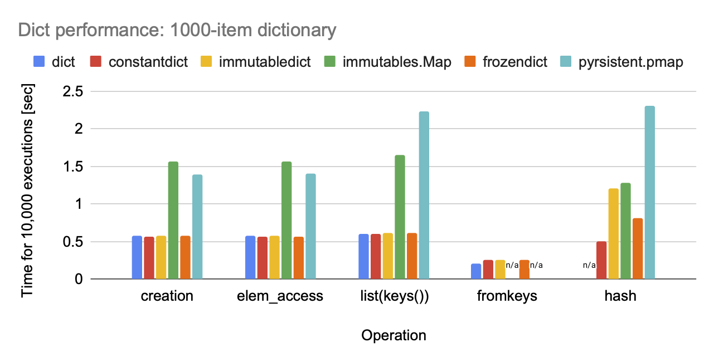

Speed comparison of dict implementations
========================================

Code
****

These results were generated with the following code:

.. literalinclude:: ../examples/speed.py
   :language: python

Results
*******

Results (total time of 10,0000 executions) for Python 3.11 on a Mac M1:

